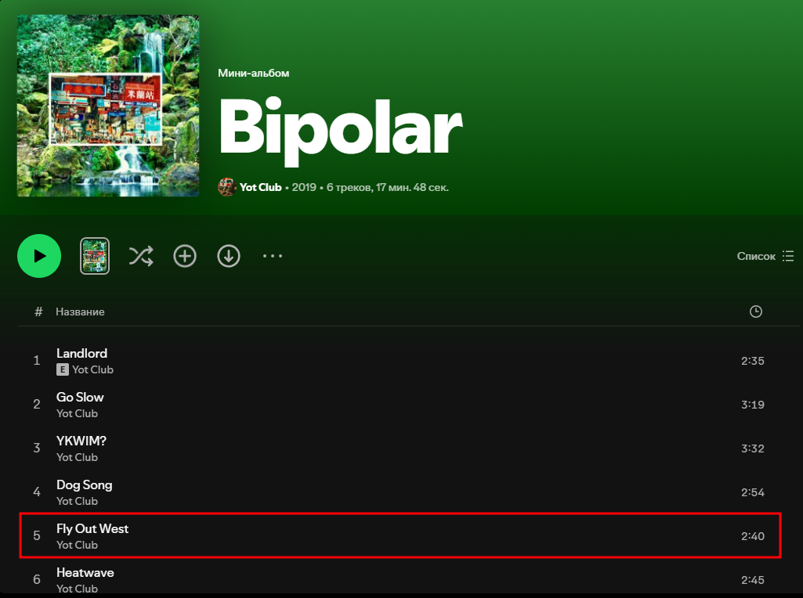
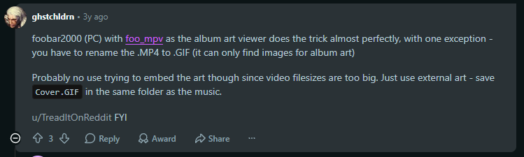
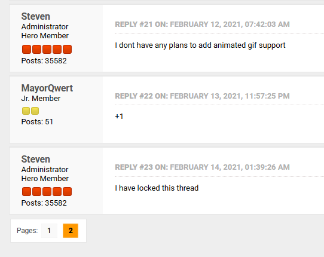

<!-- markdownlint-disable MD059 -->

# Covers and Booklets

## Embedded Covers

I embed only one cover per track — Front Cover.

**Format:** always ```.jpg```.

**Resolution:** 1200x1200 max. If the cover resolution is smaller, the largest possible resolution is used.

## External Album Cover

**Name:** ```cover```.

**Format:** ```.png```, if possible to obtain, otherwise ```.jpg```. Conversion from ```.jpg``` to ```.png``` is not allowed.

**Resolution:** any maximum possible.

**Location:** in the same folder as the audio files.

## Additional Covers

Additional covers are alternative covers for songs that I want to keep. Consider the following example:

1. In 2019, the single Fly Out West is released and has the following cover:


2. Later that same year, the album Bipolar is released, which contains this song in track 5 and inherits the album cover:


3. Thus the single cover is lost, which is not good, so I save it separately and add it to the covers folder.

Additional covers can also come from other places, for example, unreleased materials, scans, and so on.  
A fun example can be seen [here](https://www.reddit.com/r/lanadelrey/comments/14x4amo/did_you_know_that_theres_a_tunnel_under_ocean/); this album has six covers in total (and one even has boobs :grin:)!

---

**Names of tracks covers:** ```cover-<Disc number>-<Track number with leading zero>```.  
For example: ```cover-1-03.jpg```, ```cover-1-09.png```.

**Names of album covers:** ```cover-<Cover number>```.  
For example: ```cover-3``` means the third alternative album cover.

**Other names:** ```back-spine```, ```medium```, ```tray```, ```back-spine-front``` and so on.  
More details can be read [here](https://musicbrainz.org/doc/Cover_Art/Types).  
I do not save obi, stickers, and some other cover types.

**Format:** ```.png```, if possible to obtain, otherwise ```.jpg```. Conversion from ```.jpg``` to ```.png``` is not allowed.

**Resolution:** any maximum possible.

**Location:** in the ```covers``` directory.

## Booklets

A booklet does not necessarily have to match a specific release.  
For example: a digital release may have a CD booklet; a UK release may have a booklet for a Japanese release, and so on.

**Name:** ```booklet-<Page number with leading zero>``` or ```booklet-<Page number with leading zero>-<Next page number with leading zero>```.  
For example: ```booklet-11-12.jpg```, ```booklet-06.png```.

**Other names:** ```booklet-outside```.  

**Format:** ```.png```, if possible to obtain, otherwise ```.jpg```. Conversion from ```.jpg``` to ```.png``` is not allowed.

**Resolution:** any maximum possible.

**Location:** in the ```booklet``` directory.

## Animated Covers

I do not use or save animated covers for the following reasons:

1. Many animated covers are just pulsating static images, which look rather strange in my opinion;
2. They take up a lot of space;
3. An animated cover cannot be placed in audio file tags; formats do not support them, so need to use external cover, which is inconvenient;
4. Animated covers are not natively supported almost anywhere, specifically:  
  **Foobar2000** — not supported natively, requires a plugin ([discussion #1](https://www.reddit.com/r/musichoarder/comments/1aeucbn/comment/koa83a9/), [discussion #2](https://www.reddit.com/r/foobar2000/comments/1dpgijy/does_animated_cover_art_work/)):
  
  **Poweramp** — not supported ([discussion](https://forum.powerampapp.com/topic/29600-animated-song-cover/)):
  
  **MusicBee** — not supported and not planned ([discussion](https://getmusicbee.com/forum/index.php?topic=370.msg187355#msg187355)):
  
