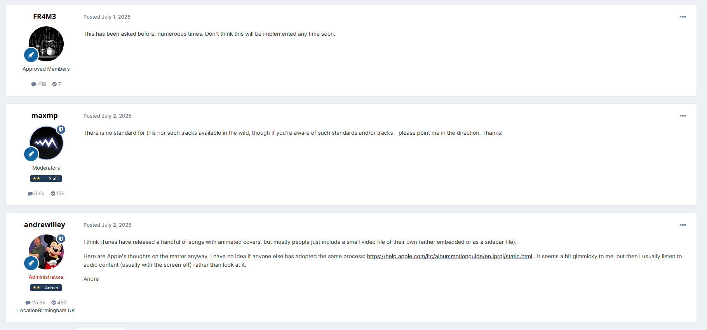

<!-- markdownlint-disable MD059 -->

# Covers, Scans and Booklets

## Embedded Covers

I embed only one cover per track, using the Front Cover picture type.

**Format:** always `JPEG`.

**Resolution:** 1200x1200 pixels max. If cover at that resolution is unavailable, I use the highest available resolution without upscaling.

## External Album Cover

**Name:** `cover`.

**Format:** `.png`, when the original cover is available in this format; otherwise `.jpg`. Conversion from `.jpg` to `.png` is not allowed.

**Resolution:** highest available resolution.

**Location:** in the same folder as the audio files.

## Physical release scans

For more information about types of covers and scans, see [MusicBrainz Docs](https://musicbrainz.org/doc/Cover_Art/Types).  
You can read about scanning process in [MusicHoarders Wiki](https://musichoarders.xyz/guides/scanning-media).  
Scan naming rules are covered in the [same place](https://musichoarders.xyz/reference/naming-scans). However, I keep all scan filenames in lowercase.

**Format:** `.png`, when the original cover is available in this format; otherwise `.jpg`. Conversion from `.jpg` to `.png` is not allowed.

**Resolution:** highest available resolution.

**Location:** in the `scans` directory.

## Additional Covers

> [!WARNING]
> Materials scanned directly from physical releases **does not belong** in this section, even if it serves a similar purpose.  
> They are covered in the "Physical release scans" section and should be stored as follows:
>
> - in the `scans` directory, if release is physical and scans were made directly from it;
> - in the `other materials` directory, if release is digital and/or scans were sourced elsewhere.

Additional covers are an addition to the album or single.  
For example: alternative single/album covers, unreleased materials, posters.  
Consider the following example:

1. In 2019, the single Fly Out West is released and has the following cover:

1. Later that same year, the album Bipolar is released, including the song as track 5 and using the album cover:

1. Thus the single cover is lost, which is not good, so I save it separately and add it to the `other materials` folder.

Additional covers can also come from other places, for example, unreleased materials or videos.  
A funny example is a [Reddit post](https://www.reddit.com/r/lanadelrey/comments/14x4amo/did_you_know_that_theres_a_tunnel_under_ocean/); this album has six covers in total!

---

**Track-cover filenames:** `cover <Disc number>.<Track number with leading zero>`.  
For example: `cover 1.03.jpg`, `cover 1.09.png`.

**Album-cover filenames:** `cover <Cover number>`.  
For example: `cover 3` means the third alternative album cover.

**Other cover filenames:** `video background`, `poster`.  

**Format:** `.png`, when the original cover is available in this format; otherwise `.jpg`. Conversion from `.jpg` to `.png` is not allowed.

**Resolution:** highest available resolution.

**Location:** in the `other materials` directory.

## Booklets

> [!WARNING]
> Booklets are stored as follows:
>
> - in the `scans` directory, if release is physical and booklet was scanned directly from it;
> - in the `other materials` directory, if release is digital and/or booklet was sourced elsewhere.

A booklet does not necessarily have to match a specific release.  
For example: a digital release may contain a CD booklet; a UK release may contain a booklet sourced from the Japanese edition.

**Name:** `booklet <Page number with leading zero>` or `booklet <Page number with leading zero>-<Next page number with leading zero>`.  
For example: `booklet 11-12.jpg`, `booklet 06.png`.

**Other names:** `booklet outside`, `booklet lyrics 01`, `booklet inside`.  

**Format:** `.png`, when the original cover is available in this format; otherwise `.jpg`. Conversion from `.jpg` to `.png` is not allowed.

**Resolution:** highest available resolution.

**Location:** in the `other materials` directory.

## Animated Covers

I do not use or save animated covers for the following reasons:

1. Many animated covers are just pulsating static images, which look rather strange in my opinion;
2. They take up a lot of space;
3. Support for embedding and displaying animated covers is inconsistent across tag formats and music players;
4. As of August 2026, animated covers are not natively supported almost anywhere, specifically:  
  **foobar2000** — not supported natively, requires a plugin ([discussion №1](https://www.reddit.com/r/musichoarder/comments/1aeucbn/comment/koa83a9/), [discussion №2](https://www.reddit.com/r/foobar2000/comments/1dpgijy/does_animated_cover_art_work/)):
  
  **Poweramp** — not supported ([discussion](https://forum.powerampapp.com/topic/29600-animated-song-cover/)):
  
  **MusicBee** — not supported and not planned ([discussion](https://getmusicbee.com/forum/index.php?topic=370.msg187355#msg187355)):
  
