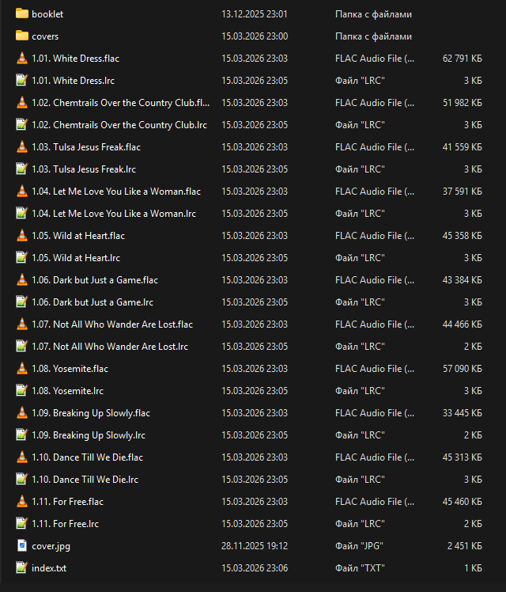

<!-- markdownlint-disable MD059 -->

# Library Structure

## Directory Structure

The root folder of the library is ``Music``.

For convenience, I treat an album as the main structural unit of the library.

The path to each album follows this structure:

```text
<Album Artist>/<Year of Release> - <Album Title>
```

For example:

- ``Music/Ice Cube/1992 - The Predator``
- ``Music/Lana Del Rey/2012 - Born to Die – The Paradise Edition (Special Version)``

## File Naming

Each track within an album directory follows this naming convention:

```text
<Disc Number>.<Track Number with leading zero>. <Track Title>.<Extension>
```

For example:

- ``1.07. It Was a Good Day.flac``
- ``2.01. Ride.flac``

Files containing the corresponding song lyrics use the same name but a different extension: .lrc.

- ``1.07. It Was a Good Day.lrc``
- ``2.01. Ride.lrc``

Forbidden characters in names:

- Characters that are invalid in Windows: ```/\\:*?<>|```;
- ASCII control characters and non-breaking spaces.

For track names, I use English and Russian titles. If a track has a title in another language, such as Japanese, I use either the romaji title or an English translation, with romanization preferred.
For example, a track titled ```心に穴が空いた``` will be named either ```Kokoro ni Ana ga Aita``` or ```Hole In The Heart```.  
This makes the tracks easier to search for.

## Album Structure

Each album directory follows this structure:

- Audio files (```.flac```, ```.m4a```, ```.mp3``` and so on), more details [here](/en-us/audio-formats/ 'Audio Formats')
- Lyrics files (```.lrc```), more details [here](/en-us/lyrics/ 'Lyrics')
- External album cover (```cover```), more details [here](/en-us/covers-and-booklets/?id=External-album-cover 'Covers and Booklets')
- Index file (```index.txt```), more details [here](/en-us/indexing/ 'Indexing')
- Directory with booklets (```booklet```) — when needed, more details [here](/en-us/covers-and-booklets/?id=Booklets 'Covers and Booklets')
- Directory with additional covers (```covers```) — when needed, more details [here](/en-us/covers-and-booklets/?id=Additional-covers 'Covers and Booklets')

For example:


