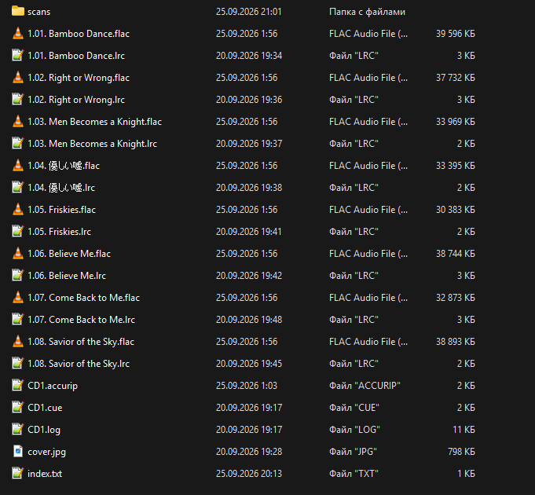

<!-- markdownlint-disable MD059 -->

# Library Structure

## Directory Structure

Audio files are stored in two directories:

- `music library` is main library directory. Used for sharing;
- `music sharing` is dedicated for sharing releases excluded from the main library (for example, physical releases when a higher-quality digital version exists in `music library`).

Both directories have same structure, so everything described below applies to each of them.

---

The path to digital release follows this structure:

```text
WEB/<Album Artist>/<Release Year> - <Album Title>
```

For example:

- `music library/WEB/Ice Cube/1992 - The Predator`
- `music library/WEB/Lana Del Rey/2012 - Born to Die - The Paradise Edition (Special Version)`

---

The path to physical release follows this structure:

```text
CD/<Album Artist>/[<Catalog Number>] [Log score] [Self-rip tag] <Release Year> - <Album Title>
```

For example:

- `music library/CD/妖精帝國/[ARCH-0001] [100%LOG] 2005 - stigma`
- `music sharing/CD/Demetori/[DECD-0006] [100%LOG] [SELF-RIP] 2009 - 曼衍珠汝華 ~ Nada Upasana Pundarika`

---

Forbidden characters in directory names (replaced with underscore character `_`):

- Characters that are invalid in Windows: `\/:*?"<>|`;
- ASCII control characters;
- Windows-reserved device names;
- Non-breaking spaces;
- The dot character `.`, because directory names cannot end with it on Windows.

> [!WARNING]
> Fancy Unicode characters that resemble ASCII letters, numbers, or punctuation marks are replaced with their ASCII equivalents, or with underscore if no equivalent exists. For more details, see [MusicHoarders Wiki](https://musichoarders.xyz/reference/bibles/the-salty-bible/#35-do-not-use-fancy-unicode-symbols-for-common-punctuation-marks).  
> This applies only when such Unicode characters carry no semantic weight.
> This does not apply when Unicode characters are used intentionally (as in this [Bandcamp release](https://00000ooooo.bandcamp.com/album/--5)) or are [part of a writing system](https://en.wikipedia.org/wiki/Japanese_punctuation).

Examples:

- `TOHO EUROBEAT VOL.1` is replaced by `TOHO EUROBEAT VOL_1`;
- `POST HUMAN: SURVIVAL HORROR` is replaced by `POST HUMAN_ SURVIVAL HORROR`;
- Unicode characters in `妖精帝國` are not replaced with underscores, as they are part of a writing system;
- Unicode characters in `(V)・∀・(V)` are not replaced with underscores, because they are used intentionally by artist.

> [!NOTE]
I use the original names of artists, releases and tracks and do not translate or transliterate them, as this may lead to a loss of nuances and errors.

## File Naming

Each track within album directory follows this naming convention:

```text
<Disc Number>.<Track Number with leading zero>. <Track Title>.<Extension>
```

For example:

- `1.07. It Was a Good Day.flac`
- `2.01. Ride.flac`

---

The corresponding lyrics files use the same base filename with the `.lrc` extension:

- `1.07. It Was a Good Day.lrc`
- `2.01. Ride.lrc`

---

Forbidden characters in file names (replaced with underscore character `_`):

- Characters that are invalid in Windows: `\/:*?"<>|`;
- ASCII control characters;
- Windows-reserved device names;
- Non-breaking spaces.

> [!WARNING]
> Fancy Unicode characters that resemble ASCII letters, numbers, or punctuation marks are replaced with their ASCII equivalents, or with underscore if no equivalent exists. For more details, see [MusicHoarders Wiki](https://musichoarders.xyz/reference/bibles/the-salty-bible/#35-do-not-use-fancy-unicode-symbols-for-common-punctuation-marks).  
> This applies only when such Unicode characters carry no semantic weight.
> This does not apply when Unicode characters are used intentionally (as in this [Bandcamp release](https://00000ooooo.bandcamp.com/album/--5)) or are [part of a writing system](https://en.wikipedia.org/wiki/Japanese_punctuation).

Examples:

- `why you gotta kick me when i'm down?` is replaced by `why you gotta kick me when i'm down_`;
- `Light travel distance / RAYTO MIX` is replaced by `Light travel distance _ RAYTO MIX`;
- `感情の魔天楼 ～ World's End` (tilde Unicode) is replaced by `感情の魔天楼 ~ World's End` (tilde ASCII);
- Unicode characters in the `ハートに火をつけて` are not replaced with underscores, as they are part of a writing system;
- Unicode infinity symbol in `Miracle∞Hinacle` is not replaced with underscore, because it is used intentionally in title.

## Album Structure

Each album directory follows this structure:

- Audio files (`.flac`, `.m4a`, `.mp3` and so on), see [Audio Formats](/en-us/audio-formats/) section;
- Lyrics files (`.lrc`), see [Lyrics](/en-us/lyrics/) section;
- External album cover (`cover`), see [Covers, Scans and Booklets](/en-us/covers-and-booklets/?id=External-album-cover) section;
- Index file (`index.txt`), see [Indexing](/en-us/indexing/) section;
- Directory with physical release scans (`scans`), when applicable, see [Covers, scans, booklets](en-us/covers-and-booklets/?id=physical-release-scans) section;
- Directory with other materials (`other materials`), when applicable, see [Covers, scans, booklets](/en-us/covers-and-booklets/?id=Additional-covers) section;
- `.cue`, `.log` and `.accurip` files, when applicable, see [Ripping](/en-us/ripping/) section.

For example:


