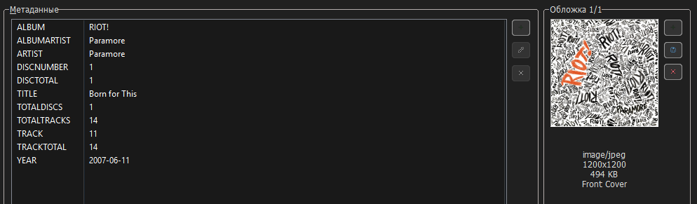
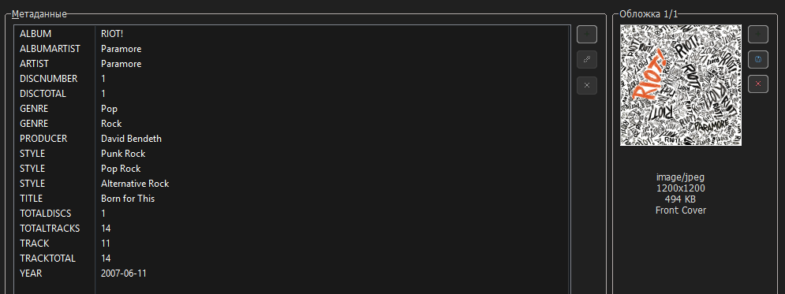

<!-- markdownlint-disable MD025 MD033 MD059 -->

# Tags

Let's start with what tags I actually use, given the huge number of them.

## Tag Priority

**Note:** the tag names used in this section are format-neutral concepts. Their actual representation depends on the metadata format.  
For example, `Album Artist` corresponds to `ALBUMARTIST` tag in **Vorbis Comment (FLAC)**, `aART` atom in **iTunes MP4 (ALAC)**, and `TPE2` frame in **ID3v2 (MP3)**.

### Main Tags

**Main tags** are required in every audio file.

- `Album` — album title;

- `Album Artist` — album artist;

- `Artist` — track artist or artists;  
  **Note:** if there are several artists on the track, then characters ``\\`` are used as a separator between them.  
  In [Mp3tag](https://www.mp3tag.de/en/) program, multiple values are displayed using `\\`. The `\\` separator itself is not stored in the tag field.  
  I do not use the following separators for artists: ``feat.``, ``&``, ``,``, ``;``, as well as any others.  
  **Examples:** `Lana Del Rey\\Zella Day\\Weyes Blood`, `Zachz Winner\\Frozy\\joyful`

- `Date` — release date of a specific release;  
  **Format:** `YYYY-MM-DD` (or `YYYY` if the exact day and month are unknown)  
  **ID3v2.3 Feature**: [ID3v2.3](https://id3.org/id3v2.3.0) specification limits the `TYER` frame to only year (`YYYY`), but taggers (MusicBrainz Picard, Mp3tag) write the full date directly into `TYER` without separating it from the `TDAT` frame, as prescribed by the standard.

- `Disc Number` — disc number;

- `Disc Total` — total number of discs;

- `Title` — track title;

- `Track Number` — track number;

- `Track Total` — total number of tracks;

- `Cover` — embedded cover for the track. More details [here](/en-us/covers-and-booklets/?id=Embedded-covers).

A typical file with the main tags filled looks like this:

**Note:** in Mp3tag, the `Date` tag is displayed as `YEAR`.

### Extended Tags

**Extended tags** provide additional information about a release. They are quite useful, and almost all of them can be applied to almost all releases.

For subsequent tags, I also indicate whether they can be displayed and used for sorting in the audio players I use.

- `Composer` — composer;  
  **Display:** Poweramp (+), foobar2000 (+)  
  **Sorting by this tag:** Poweramp (+), foobar2000 (+)

- `Genre` — genres;  
  **Display:** Poweramp (+), foobar2000 (+)  
  **Sorting by this tag:** Poweramp (+), foobar2000 (+)

- `Lyrics` — synchronized or unsynchronized song lyrics;  
  **Display:** Poweramp (+), foobar2000 (+)  
  **Note:** instead of this tag, I use .lrc files, see [here](/en-us/lyrics/).

- `Original Date` — original release date;  
  **Format:** `YYYY-MM-DD` (or `YYYY` if the exact day and month are unknown)  
  **Example:** this tag stores the album's original release date (for example, 1973), while the `Date` tag stores the year of a specific reissue or remaster (for example, 2011).  
  **Note:** if the values of `Date` and `Original Date` are identical, I omit `Original Date`.  
  **Display:** Poweramp (-) ([discussion](https://forum.powerampapp.com/topic/28077-originaldate-tag-support/)), foobar2000 (+)  
  **Sorting by this tag:** Poweramp (-), foobar2000 (+)

- `Producer` — producer;  
  **Display:** Poweramp (-) ([discussion](https://forum.powerampapp.com/topic/21511-producer-tag/)), foobar2000 (+)  
  **Sorting by this tag:** Poweramp (-), foobar2000 (+)

- `Style` — subgenres;  
  **Display:** Poweramp (-), foobar2000 (+)  
  **Sorting by this tag:** Poweramp (-), foobar2000 (+)

How it will look like:

### Specialized Tags

**Specialized tags** are optional and used only when relevant. Some may be filled automatically by taggers.

- `Album Artist Sort` — controls how the album artist is sorted, for example by surname or while ignoring leading articles;  
  **Example:** `Beatles, The` instead of `The Beatles`, so they will sort by B rather than T.  
  **Sorting by this tag:** Poweramp (-) (there is another setting to ignore articles), foobar2000 (+) (pattern setup required)

- `Artist Sort` — similar to the previous tag, but controls how the track artist is sorted;  
  **Sorting by this tag:** Poweramp (-) (there is another setting to ignore articles), foobar2000 (+) (pattern setup required)

- `Barcode` — a unique barcode for the music release, useful for identifying it across databases, digital stores, streaming services and other services;  
  **Display:** Poweramp (-), foobar2000 (+)  
  **Sorting by this tag:** Poweramp (-), foobar2000 (+)

- `BPM` — beats per minute;  
  **Display:** Poweramp (-) ([discussion](https://forum.powerampapp.com/topic/24384-sort-option-for-beats-per-minute-bpm/)), foobar2000 (+)  
  **Sorting by this tag:** Poweramp (-), foobar2000 (+)

- `Catalog Number` — a unique serial number of the music label's release, used to identify releases within the label's catalog;  
  **Display:** Poweramp (-), foobar2000 (+)  
  **Sorting by this tag:** Poweramp (-), foobar2000 (+)

- `Comment` — comment;  
  **Display:** Poweramp (+), foobar2000 (+)  
  **Sorting by this tag:** Poweramp (+), foobar2000 (+)  
  **Note:** I store the original name of the artist, track, and release in this tag if it is not initially Russian/English.  
  **Structure:** `[Original Artist Name] - [Original Track Title] ([Original Album Name])`  
  **Example:** `ヨルシカ - 思想犯 (盗作)`

- `Compilation` — a flag indicating that a track is part of a compilation;  
  **Sorting by this tag:** Poweramp (-), foobar2000 (pattern setup required)

- `Copyright` — copyright information for the release;  
  **Example:** `A Polydor Records Release / An Interscope Records Release in the USA; ℗ 2021 Lana Del Rey, under exclusive licence to Universal Music Operations Limited`.  
  **Display:** Poweramp (-), foobar2000 (+)  

- `ISRC` — a unique international code assigned to audio recording, useful for identifying it across databases, digital stores, streaming services and other services;  
  **Display:** Poweramp (-), foobar2000 (+)  
  **Sorting by this tag:** Poweramp (-), foobar2000 (+)

- `Grouping` — a tag that provides an additional grouping level between the release and individual tracks;  
  **Example:**  
  Consider [this release](https://open.spotify.com/album/6eOuqhCfrTPp1H0YbQ9PmL); it contains two symphonies: No. 5 and No. 7.  
  
  If you add `Symphony No. 5 in C Minor, Op. 67` to `Grouping` tag for tracks 1-4 and `Symphony No. 7 in A Major, Op. 92` for tracks 5 onward, then track 1 will display a badge for Symphony No. 5 and track 5 will display a badge for Symphony No. 7 (if the audio player supports such display)  
  **Display:** Poweramp (-) ([discussion](https://forum.powerampapp.com/topic/28102-grouping-tag-support/)), foobar2000 (+) (pattern setup required)

- `Label` — label;  
  **Display:** Poweramp (-) ([discussion](https://forum.powerampapp.com/topic/28045-support-for-displaying-publisher-tag/)), foobar2000 (+)  
  **Sorting by this tag:** Poweramp (-), foobar2000 (+)

- `Language` — the language or languages spoken or sung in the track;  
  **Note:** this is a three-character language code. MusicBrainz [uses codes](https://picard-docs.musicbrainz.org/en/latest/variables/tags_advanced.html) from the [ISO 639-3](https://en.wikipedia.org/wiki/ISO_639-3) standard, and [ID3v2.3](https://id3.org/id3v2.3.0) and [ID3v2.4](https://id3.org/id3v2.4.0-frames) specifications refer to the [ISO 639-2](https://en.wikipedia.org/wiki/ISO_639-2) standard when it comes to the `TLAN` frame.  
  **Examples:** `eng`, `rus`, `jpn`, `zxx` (instrumental)  
  **Display:** Poweramp (-), foobar2000 (+)  
  **Sorting by this tag:** Poweramp (-), foobar2000 (+)

- `Media` — source of the release;  
  **Examples:** `CD`, `WEB`, `SACD`, `Vinyl`  
  **Display:** Poweramp (-), foobar2000 (+)  
  **Sorting by this tag:** Poweramp (-), foobar2000 (+)

- `MusicBrainz IDs` — unique identifiers from the MusicBrainz database;  
  **Specifically:**
  - `MusicBrainz Artist ID` - multi-value tag containing the MBIDs for the track artists;
  - `MusicBrainz Recording ID` - tag containing the MBID for the recording;
  - `MusicBrainz Release Artist ID` - multi-value tag containing the MBIDs for the release artists;
  - `MusicBrainz Release Group ID` - tag containing the MBID for the release group;
  - `MusicBrainz Release ID` - tag containing the MBID for the release;
  - `MusicBrainz Track ID` - tag containing the MBID for the track;
  - `MusicBrainz Work ID` - tag containing the MBID for the Work if a related work exists.
  **Display:** Poweramp (-), foobar2000 (+)  
  **Sorting by this tag:** Poweramp (-), foobar2000 (+)  
  **Note:** read more [here](https://musicbrainz.org/doc/MusicBrainz_Identifier), [here](https://picard-docs.musicbrainz.org/en/latest/variables/tags_basic.html) and [here](https://picard-docs.musicbrainz.org/en/latest/appendices/tag_mapping.html).  
  These tags are also useful for linking with media-servers (Navidrome, Plex), scrobblers (ListenBrainz, self-hosted scrobblers), and the MusicBrainz database itself.

- `Performer` — tags containing performer names together with their instruments or roles;  
  **Examples:** `Yuri Kaplan (Vocals, Electric Guitar)`, `Vladimir Yakovlev (Drums)`, `Konstantin Pyzhov (Electric Guitar)`, `Stanislav Murashko (Bass Guitar)`  
  **Display:** Poweramp (-), foobar2000 (+)  
  **Sorting by this tag:** Poweramp (-), foobar2000 (+)

- `Release Country` — the country associated with the release;  
  **Examples:** `US`, `JP`, `GB`, `XW` (worldwide).  
  **Display:** Poweramp (-), foobar2000 (+)  
  **Sorting by this tag:** Poweramp (-), foobar2000 (+)

- `Remixer` — the person responsible for remixing the track;  
  **Display:** Poweramp (-), foobar2000 (+)  
  **Sorting by this tag:** Poweramp (-), foobar2000 (+)

- `ReplayGain Tags` - tags that are responsible for ReplayGain;  
  **Specifically:**
  - `ReplayGain Track Gain` - tag that contains the volume correction value (in dB) for one specific track to match the 89 dB SPL level;
  - `ReplayGain Track Peak` - tag that contains the maximum peak volume level within one track. If gain exceeds the maximum allowable digital level (0 dBFS), then clipping will occur;
  - `ReplayGain Album Gain` - tag that contains the volume correction value (in dB) for the entire album. This equalizes the overall level of the album relative to 89 dB SPL, but at the same time completely preserves contrast between quiet and loud songs inside the album;
  - `ReplayGain Album Peak` - tag that contains the maximum peak volume level among all album tracks.

  **Working with ReplayGain:** Poweramp (+), foobar2000 (+)  
  **Note:** read more [here](https://ru.wikipedia.org/wiki/ReplayGain ) and [here](https://wiki.hydrogenaudio.org/index.php/ReplayGain).

The final result looks like this:

### Excluded Tags

**Excluded tags** are tags that I don't use for any of these reasons:

- They contain information that others don't need, i.e. information that only makes sense to one person;
- They contain information that has little practical use, or is not reliable as information about the origin;
- They duplicate or partially duplicate information that is already stored in other tags;
- They contain information that I am not interested in.

---

- `Artists` - multi-value tag that stores a list of several artists;  
  **Note:** This tag is generated and filled automatically by MusicBrainz Picard if the relevant information is available in the MusicBrainz database. More details [here](https://picard-docs.musicbrainz.org/en/latest/variables/tags_basic.html).

- `Encoder` — the encoder program/library that created/re-encoded the audio file;

- `Encoded By` — the person or organization responsible for encoding or re-encoding the audio file;

- `First Played` — the date when the person first played the track;  
  **Format:** usually `YYYY-MM-DD HH:MM:SS`

- `Last Played` — the date when the person last played the track;  
  **Format:** usually `YYYY-MM-DD HH:MM:SS`

- `Mixer` — the person responsible for mixing the audio recording;

- `Mood` — the mood of the track;  
  **Note:** a decent mood methodology is provided [here](https://sites.tufts.edu/eeseniordesignhandbook/2015/music-mood-classification/).

- `Play Count` — number of times the track has been played;

- `Original Year` — original release year of the album;  
  **Format:** `YYYY`

- `Rating` — rating of the track;

- `Recording Copyright` — copyright information for a specific recording;

- `Release Status` — the release's distribution status;  
  **Examples**: `official`, `bootleg`.

- `Release Type` — the release's classification;  
  **Examples**: `album`, `single`, `ep`, `remix`.

- `Script` — the script used to write the release's tracklist;  
  **Note:** script here means set of graphic characters used for the written form of one or more languages, more details [here](https://en.wikipedia.org/wiki/ISO_15924).  
  **Examples:** `Latn`, `Jpan`, `Cyrl`.

- `Subtitle` — track subtitle;  
  **Example:** if `Subtitle` tag contains `Acoustic version`, `Title` tag can remain `Track title`.  
  Without a separate `Subtitle` tag, the title would instead be stored as `Track title (Acoustic version)`.

- `URL` — a link to anything (source of the track, streaming service, and so on);

- `Work` - a distinct intellectual or artistic creation, which can be expressed in the form of one or more audio recordings. A work does not have to be musical. For example, a work could be a novel, play, poem or essay, later recorded as an audiobook;  
  **Note:** more details [here](https://musicbrainz.org/doc/Work).  

- `Writer` — songwriter (the person who wrote the words for the song).

## Tag Mapping Tables

**Disclaimer:** these tables document the mappings used by this library. Some fields use native format-specific frames or atoms, while others are stored as freeform metadata fields. They should not be interpreted as a universal mapping standard for all tagging software.

**Reference for tag mappings:** [HydrogenAudio](https://wiki.hydrogenaudio.org/index.php?title=Tag_Mapping), [Mp3tag](https://docs.mp3tag.de/mapping/), , [MusicBrainz](https://picard-docs.musicbrainz.org/en/latest/appendices/tag_mapping.html).

**Command-line utilities for inspecting native metadata fields, frames, and atoms:**

- All formats: [exiftool](https://exiftool.org/)
- FLAC: [metaflac](https://xiph.org/flac/documentation_tools.html)
- iTunes MP4 (ALAC/AAC): [atomicparsley](https://github.com/wez/atomicparsley)

**Format-specific notes:**

- iTunes MP4:  
  Atoms beginning with `----` are stored as freeform metadata.

- ID3v2.3 (MP3):  
  In practice, taggers (MusicBrainz Picard, Mp3tag) write the full date (`YYYY-MM-DD`) into the `TYER` frame, without using the `TDAT` frame.  
  `TYER` is marked with an asterisk in the table.

### Main Tags Table

<table>
  <thead>
    <tr>
      <th>Tag name</th>
      <th>Vorbis Comment (FLAC)</th>
      <th>iTunes MP4 (ALAC, AAC)</th>
      <th>ID3v2.3 (MP3)</th>
      <th>ID3v2.4 (MP3)</th>
    </tr>
  </thead>
  <tbody>
    <tr>
      <td style="font-weight: bold">Album</td>
      <td><code>ALBUM</code></td>
      <td><code>©alb</code></td>
      <td colspan="2"><code>TALB</code></td>
    </tr>
    <tr>
      <td style="font-weight: bold">Album Artist</td>
      <td><code>ALBUMARTIST</code></td>
      <td><code>aART</code></td>
      <td colspan="2"><code>TPE2</code></td>
    </tr>
    <tr>
      <td style="font-weight: bold">Artist</td>
      <td><code>ARTIST</code></td>
      <td><code>©ART</code></td>
      <td colspan="2"><code>TPE1</code></td>
    </tr>
    <tr>
      <td style="font-weight: bold">Date</td>
      <td><code>DATE</code></td>
      <td><code>©day</code></td>
      <td><code>TYER</code>*</td>
      <td><code>TDRC</code></td>
    </tr>
    <tr>
      <td style="font-weight: bold">Disc Number</td>
      <td><code>DISCNUMBER</code></td>
      <td><code>disk</code></td>
      <td colspan="2"><code>TPOS</code></td>
    </tr>
    <tr>
      <td style="font-weight: bold">Disc Total</td>
      <td><code>DISCTOTAL</code></td>
      <td><code>----:com.apple.iTunes:DISCTOTAL</code>
      <td colspan="2"><code>TXXX_DISCTOTAL</code>
    </tr>
    <tr>
      <td style="font-weight: bold">Title</td>
      <td><code>TITLE</code></td>
      <td><code>©nam</code></td>
      <td colspan="2"><code>TIT2</code></td>
    </tr>
    <tr>
      <td style="font-weight: bold">Track Number</td>
      <td><code>TRACKNUMBER</code></td>
      <td ><code>trkn</code></td>
      <td colspan="2"><code>TRCK</code></td>
    </tr>
    <tr>
      <td style="font-weight: bold">Track Total</td>
      <td><code>TRACKTOTAL</code></td>
      <td><code>----:com.apple.iTunes:TRACKTOTAL</code>
      <td colspan="2"><code>TXXX_TRACKTOTAL</code></td>
    </tr>
    <tr>
      <td style="font-weight: bold">Cover</td>
      <td><code>METADATA_BLOCK_PICTURE</code></td>
      <td><code>covr</code></td>
      <td colspan="2"><code>APIC</code></td>
    </tr>
  </tbody>
</table>

### Extended Tags Table

<table>
  <thead>
    <tr>
      <th>Tag name</th>
      <th>Support in Poweramp</th>
      <th>Support in foobar2000</th>
      <th>Vorbis Comment (FLAC)</th>
      <th>iTunes MP4 (ALAC, AAC)</th>
      <th>ID3v2.3 (MP3)</th>
      <th>ID3v2.4 (MP3)</th>
    </tr>
  </thead>
  <tbody>
    <tr>
      <td style="font-weight: bold">Composer</td>
      <td>+</td>
      <td>+</td>
      <td><code>COMPOSER</code></td>
      <td><code>©wrt</code></td>
      <td colspan="2"><code>TCOM</code></td>
    </tr>
    <tr>
      <td style="font-weight: bold">Genre</td>
      <td>+</td>
      <td>+</td>
      <td><code>GENRE</code></td>
      <td><code>©gen</code></td>
      <td colspan="2"><code>TCON</code></td>
    </tr>
    <tr>
      <td style="font-weight: bold">Lyrics</td>
      <td>+</td>
      <td>+</td>
      <td><code>UNSYNCEDLYRICS</code></td>
      <td><code>©lyr</code></td>
      <td colspan="2"><code>USLT</code></td>
    </tr>
    <tr>
      <td style="font-weight: bold">Original Date</td>
      <td>-</td>
      <td>+</td>
      <td><code>ORIGINALDATE</code></td>
      <td><code>----:com.apple.iTunes:ORIGINALYEAR</code></td>
      <td colspan="2"><code>TXXX_ORIGINALDATE</code></td>
    </tr>
    <tr>
      <td style="font-weight: bold">Producer</td>
      <td>-</td>
      <td>+</td>
      <td><code>PRODUCER</code></td>
      <td><code>----:com.apple.iTunes:PRODUCER</code></td>
      <td colspan="2"><code>TXXX_PRODUCER</code></td>
    </tr>
    <tr>
      <td style="font-weight: bold">Style</td>
      <td>-</td>
      <td>+</td>
      <td><code>STYLE</code></td>
      <td><code>----:com.apple.iTunes:STYLE</code></td>
      <td colspan="2"><code>TXXX_STYLE</code></td>
    </tr>
  </tbody>
</table>

### Specialized Tags Table

<table>
  <thead>
    <tr>
      <th>Tag name</th>
      <th>Support in Poweramp</th>
      <th>Support in foobar2000</th>
      <th>Vorbis Comment (FLAC)</th>
      <th>iTunes MP4 (ALAC, AAC)</th>
      <th>ID3v2.3 (MP3)</th>
      <th>ID3v2.4 (MP3)</th>
    </tr>
  </thead>
  <tbody>
    <tr>
      <td style="font-weight: bold">Album Artist Sort</td>
      <td>-</td>
      <td>+</td>
      <td><code>ALBUMARTISTSORT</code></td>
      <td><code>soaa</code></td>
      <td colspan="2"><code>TSO2</code></td>
    </tr>
    <tr>
      <td style="font-weight: bold">Artist Sort</td>
      <td>-</td>
      <td>+</td>
      <td><code>ARTISTSORT</code></td>
      <td><code>soar</code></td>
      <td colspan="2"><code>TSOP</code></td>
    </tr>
    <tr>
      <td style="font-weight: bold">Barcode</td>
      <td>-</td>
      <td>+</td>
      <td><code>BARCODE</code></td>
      <td><code>----:com.apple.iTunes:BARCODE</code></td>
      <td colspan="2"><code>TXXX_BARCODE</code></td>
    </tr>
    <tr>
      <td style="font-weight: bold">BPM</td>
      <td>-</td>
      <td>+</td>
      <td><code>BPM</code></td>
      <td><code>tmpo</code></td>
      <td colspan="2"><code>TBPM</code></td>
    </tr>
    <tr>
      <td style="font-weight: bold">Catalog Number</td>
      <td>-</td>
      <td>+</td>
      <td><code>CATALOGNUMBER</code></td>
      <td><code>----:com.apple.iTunes:CATALOGNUMBER</code></td>
      <td colspan="2"><code>TXXX_CATALOGNUMBER</code></td>
    </tr>
    <tr>
      <td style="font-weight: bold">Comment</td>
      <td>+</td>
      <td>+</td>
      <td><code>COMMENT</code></td>
      <td><code>©cmt</code></td>
      <td colspan="2"><code>COMM</code></td>
    </tr>
    <tr>
      <td style="font-weight: bold">Compilation</td>
      <td>-</td>
      <td>+</td>
      <td><code>COMPILATION</code></td>
      <td><code>cpil</code></td>
      <td colspan="2"><code>TCMP</code></td>
    </tr>
    <tr>
      <td style="font-weight: bold">Copyright</td>
      <td>-</td>
      <td>+</td>
      <td><code>COPYRIGHT</code></td>
      <td><code>cprt</code></td>
      <td colspan="2"><code>TCOP</code></td>
    </tr>
    <tr>
      <td style="font-weight: bold">ISRC</td>
      <td>-</td>
      <td>+</td>
      <td><code>ISRC</code></td>
      <td><code>----:com.apple.iTunes:ISRC</code></td>
      <td colspan="2"><code>TSRC</code></td>
    </tr>
    <tr>
      <td style="font-weight: bold">Grouping</td>
      <td>-</td>
      <td>+</td>
      <td><code>GROUPING</code></td>
      <td><code>----:com.apple.iTunes:GROUPING</code></td>
      <td colspan="2"><code>GRP1</code></td>
    </tr>
    <tr>
      <td style="font-weight: bold">Label</td>
      <td>-</td>
      <td>+</td>
      <td><code>LABEL</code></td>
      <td><code>----:com.apple.iTunes:LABEL</code></td>
      <td colspan="2"><code>TXXX_LABEL</code></td>
    </tr>
    <tr>
      <td style="font-weight: bold">Language</td>
      <td>-</td>
      <td>+</td>
      <td><code>LANGUAGE</code></td>
      <td><code>----:com.apple.iTunes:LANGUAGE</code></td>
      <td colspan="2"><code>TLAN</code></td>
    </tr>
    <tr>
      <td style="font-weight: bold">Media</td>
      <td>-</td>
      <td>+</td>
      <td><code>MEDIA</code></td>
      <td><code>----:com.apple.iTunes:MEDIA</code></td>
      <td colspan="2"><code>TXXX_MEDIA</code></td>
    </tr>
<tr>
      <td style="font-weight: bold">MusicBrainz Artist ID</td>
      <td>-</td>
      <td>+</td>
      <td><code>MUSICBRAINZ_ARTISTID</code></td>
      <td><code>----:com.apple.iTunes:MusicBrainz Artist Id</code></td>
      <td colspan="2"><code>TXXX:MusicBrainz Artist Id</code></td>
    </tr>
    <tr>
      <td style="font-weight: bold">MusicBrainz Recording ID</td>
      <td>-</td>
      <td>+</td>
      <td><code>MUSICBRAINZ_TRACKID</code></td>
      <td><code>----:com.apple.iTunes:MusicBrainz Track Id</code></td>
      <td colspan="2"><code>UFID:http://musicbrainz.org</code></td>
    </tr>
    <tr>
      <td style="font-weight: bold">MusicBrainz Release Artist ID</td>
      <td>-</td>
      <td>+</td>
      <td><code>MUSICBRAINZ_ALBUMARTISTID</code></td>
      <td><code>----:com.apple.iTunes:MusicBrainz Album Artist Id</code></td>
      <td colspan="2"><code>TXXX:MusicBrainz Album Artist Id</code></td>
    </tr>
    <tr>
      <td style="font-weight: bold">MusicBrainz Release Group ID</td>
      <td>-</td>
      <td>+</td>
      <td><code>MUSICBRAINZ_RELEASEGROUPID</code></td>
      <td><code>----:com.apple.iTunes:MusicBrainz Release Group Id</code></td>
      <td colspan="2"><code>TXXX:MusicBrainz Release Group Id</code></td>
    </tr>
    <tr>
      <td style="font-weight: bold">MusicBrainz Release ID</td>
      <td>-</td>
      <td>+</td>
      <td><code>MUSICBRAINZ_ALBUMID</code></td>
      <td><code>----:com.apple.iTunes:MusicBrainz Album Id</code></td>
      <td colspan="2"><code>TXXX:MusicBrainz Album Id</code></td>
    </tr>
    <tr>
      <td style="font-weight: bold">MusicBrainz Track ID</td>
      <td>-</td>
      <td>+</td>
      <td><code>MUSICBRAINZ_RELEASETRACKID</code></td>
      <td><code>----:com.apple.iTunes:MusicBrainz Release Track Id</code></td>
      <td colspan="2"><code>TXXX:MusicBrainz Release Track Id</code></td>
    </tr>
    <tr>
      <td style="font-weight: bold">MusicBrainz Work ID</td>
      <td>-</td>
      <td>+</td>
      <td><code>MUSICBRAINZ_WORKID</code></td>
      <td><code>----:com.apple.iTunes:MusicBrainz Work Id</code></td>
      <td colspan="2"><code>TXXX:MusicBrainz Work Id</code></td>
    </tr>
    <tr>
      <td style="font-weight: bold">Performer</td>
      <td>-</td>
      <td>+</td>
      <td><code>PERFORMER</code></td>
      <td><code>----:com.apple.iTunes:PERFORMER</code></td>
      <td colspan="2"><code>TXXX_PERFORMER</code></td>
    </tr>
    <tr>
      <td style="font-weight: bold">Release Country</td>
      <td>-</td>
      <td>+</td>
      <td><code>RELEASECOUNTRY</code></td>
      <td><code>----:com.apple.iTunes:RELEASECOUNTRY</code></td>
      <td colspan="2"><code>TXXX_RELEASECOUNTRY</code></td>
    </tr>
    <tr>
      <td style="font-weight: bold">Remixer</td>
      <td>-</td>
      <td>+</td>
      <td><code>REMIXER</code></td>
      <td><code>----:com.apple.iTunes:REMIXER</code></td>
      <td colspan="2"><code>TXXX_REMIXER</code></td>
    </tr>
    <tr>
      <td style="font-weight: bold">ReplayGain Track Gain</td>
      <td>+</td>
      <td>+</td>
      <td><code>REPLAYGAIN_TRACK_GAIN</code></td>
      <td><code>----:com.apple.iTunes:replaygain_track_gain</code></td>
      <td colspan="2"><code>TXXX_replaygain_track_gain</code></td>
    </tr>
    <tr>
      <td style="font-weight: bold">ReplayGain Track Peak</td>
      <td>+</td>
      <td>+</td>
      <td><code>REPLAYGAIN_TRACK_PEAK</code></td>
      <td><code>----:com.apple.iTunes:replaygain_track_peak</code></td>
      <td colspan="2"><code>TXXX_replaygain_track_peak</code></td>
    </tr>
    <tr>
      <td style="font-weight: bold">ReplayGain Album Gain</td>
      <td>+</td>
      <td>+</td>
      <td><code>REPLAYGAIN_ALBUM_GAIN</code></td>
      <td><code>----:com.apple.iTunes:replaygain_album_gain</code></td>
      <td colspan="2"><code>TXXX_replaygain_album_gain</code></td>
    </tr>
    <tr>
      <td style="font-weight: bold">ReplayGain Album Peak</td>
      <td>+</td>
      <td>+</td>
      <td><code>REPLAYGAIN_ALBUM_PEAK</code></td>
      <td><code>----:com.apple.iTunes:replaygain_album_peak</code></td>
      <td colspan="2"><code>TXXX_replaygain_album_peak</code></td>
    </tr>
  </tbody>
</table>
