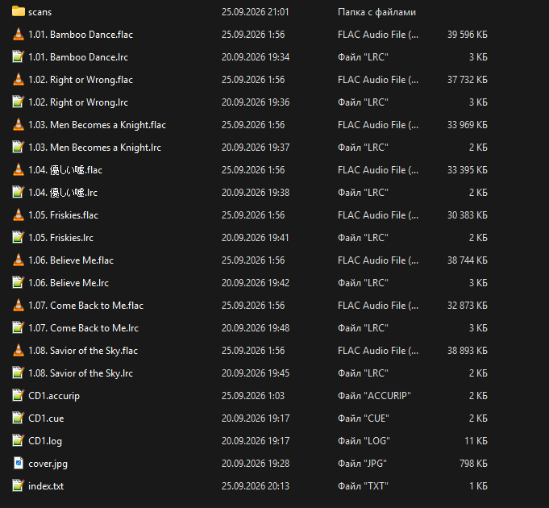

# Структура библиотеки

## Структура директорий

Корневой директорией библиотеки является `Music`

Путь до каждого альбома имеет следующую структуру:

```text
<Исполнитель альбома>/<Год выхода альбома> - <Название альбома>
```

Например:

- `Music/Ice Cube/1992 - The Predator`
- `Music/Lana Del Rey/2012 - Born to Die – The Paradise Edition (Special Version)`

Запрещенные символы в названиях директорий (заменяются на символ нижнего подчеркивания `_`):

- Недопустимые символы в Windows: `/\:*?"<>|`;
- Управляющие ASCII-символы;
- Зарезервированные имена устройств в Windows;
- Неразрывные пробелы;
- Символ точки `.`, поскольку названия директорий не могут заканчиваться этим символом в Windows;
- Unicode символы, которые заменяют или напоминают знаки препинания и какие-либо другие символы из ASCII. Подробнее можно прочитать в [MusicHoarders вики](https://musichoarders.xyz/reference/bibles/the-salty-bible/#35-do-not-use-fancy-unicode-symbols-for-common-punctuation-marks).  
  **Примечание:** это правило применяется только тогда, когда такие символы Unicode не несут смысловой нагрузки и могут быть безболезненно заменены на соответсвующие эквиваленты ASCII.  
  Например, косая черта в названии релиза `S⁄T` заменяется на косую черту из ASCII: `S/T`.  
  Исключение - случаи, когда Unicode символы используются намеренно (например, в [этом релизе на Bandcamp](https://00000ooooo.bandcamp.com/album/--5)) или являются [частью национальной письменности](https://en.wikipedia.org/wiki/Japanese_punctuation).  
  Например, в псевдониме `(V)・∀・(V)` символы Unicode не заменяются на подчеркивания.

## Наименование файлов

Каждый трек внутри директории альбома имеет следующее наименование:

```text
<Номер диска>.<Номер трека с лидирующим нулем>. <Название трека>.<Расширение>
```

Например:

- `1.07. It Was a Good Day.flac`
- `2.01. Ride.flac`

Соответствующие файлы с текстами используют то же базовое имя файла, но другое расширение - `.lrc`:

- `1.07. It Was a Good Day.lrc`
- `2.01. Ride.lrc`

Я использую оригинальные названия артистов, релизов и треков и не перевожу и не транслитерирую их, поскольку это может приводить к потере нюансов и ошибкам.

Запрещенные символы в названиях файлов (заменяются на символ нижнего подчеркивания `_`):

- Недопустимые символы в Windows: `\/:*?"<>|`;
- Управляющие ASCII-символы;
- Зарезервированные имена устройств в Windows;
- Неразрывные пробелы;
- Unicode символы, которые заменяют или напоминают знаки препинания и какие-либо другие символы из ASCII. Подробнее можно прочитать в [MusicHoarders вики](https://musichoarders.xyz/reference/bibles/the-salty-bible/#35-do-not-use-fancy-unicode-symbols-for-common-punctuation-marks).  
  **Примечание:** это правило применяется только тогда, когда такие символы Unicode не несут смысловой нагрузки и могут быть безболезненно заменены на соответсвующие эквиваленты ASCII.  
  Например, апостроф в названии трека `1.07. Nobody‛s Home` заменяется на апостроф из ASCII: `1.07. Nobody's Home`.  
  Исключение - случаи, когда Unicode символы используются намеренно (например, в [этом релизе на Bandcamp](https://00000ooooo.bandcamp.com/album/--5)) или являются [частью национальной письменности](https://en.wikipedia.org/wiki/Japanese_punctuation).  
  Например, запятые в названии трека `1.03. 夕凪、某、花惑い` не заменяются на запятые `,` из ASCII.

## Структура альбома

Каждая директория альбома имеет следующую структуру:

- Аудиофайлы (`.flac`, `.m4a`, `.mp3` и так далее), раздел [Аудиоформаты](/ru-ru/audio-formats/);
- Тексты песен (`.lrc`), раздел [Тексты песен](/ru-ru/lyrics/);
- Внешняя обложка альбома (`cover`), раздел [Обложки, сканы, буклеты](/ru-ru/covers-and-booklets/?id=Внешняя-обложка-альбома);
- Индексный файл (`index.txt`), раздел [Индексация](/ru-ru/indexing/);
- Директория со сканами физических релизов (`scans`) - при необходимости, раздел [Обложки, сканы, буклеты](/ru-ru/covers-and-booklets/?id=Сканы-физических-релизов);
- Директория с другими материалами (`other materials`) - при необходимости, раздел [Обложки, сканы, буклеты](/ru-ru/covers-and-booklets/?id=Дополнительные-обложки);
- `.cue`, `.log` и `.accurip` файлы - при необходимости, раздел [Риппинг](/ru-ru/ripping/).

Например:


