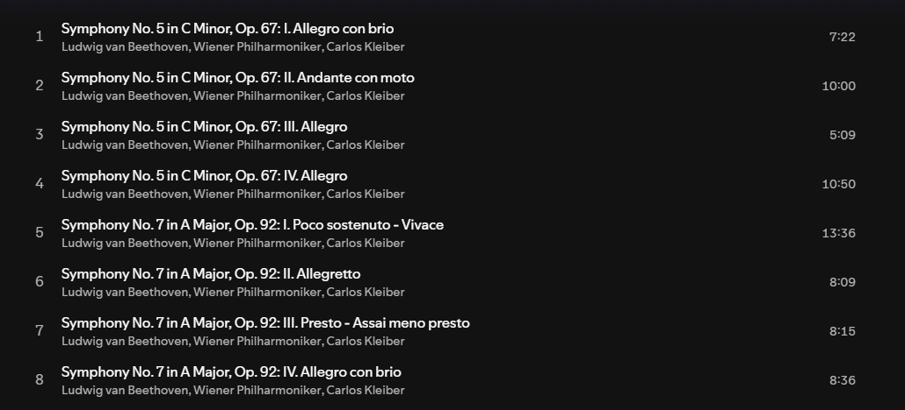
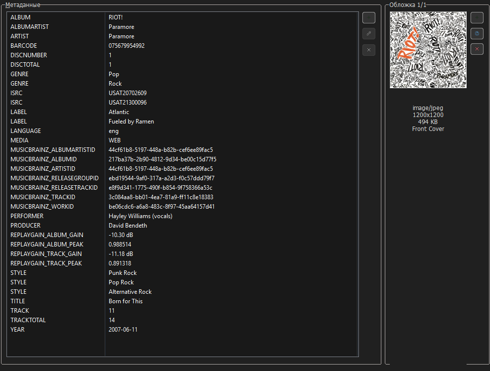

<!-- markdownlint-disable MD025 MD033 -->

# Теги

Начнём с того, какие вообще теги я использую с учётом огромного их количества.

## Разделение по приоритетам

**Примечание:** названия тегов, используемые в этом разделе, являются абстрактными концептами. Их фактическая реализация зависит от формата метаданных.  
Например, `Album Artist` соответствует тегу `ALBUMARTIST` в **Vorbis Comment (FLAC)**, атому `aART` в **iTunes MP4 (ALAC)**, и `TPE2` фрейму в **ID3v2 (MP3)**.

### Основные теги

**Основные теги** обязательны для каждого аудиофайла.

- `Album` - название альбома;  

- `Album Artist` - исполнитель альбома;  

- `Artist` - исполнитель или исполнители трека;  
  **Примечание:** если исполнителей у трека несколько, то разделителями между ними являются символы ``\\``.  
  В программе [Mp3tag](https://www.mp3tag.de/en/) несколько значений отображаются через `\\`. Сам разделитель `\\` в поле тега не сохраняется.  
  Я не использую следующие символы для разделения артистов: `feat.`, `&`, `,`, `;`, а также какие-либо другие.  
  **Примеры:** `Lana Del Rey\\Zella Day\\Weyes Blood`, `Zachz Winner\\Frozy\\joyful`

- `Date` - дата выхода конкретного релиза;  
  **Формат:** `YYYY-MM-DD` (или `YYYY`, если точный день и месяц неизвестны)  
  **Особенность ID3v2.3**: спецификация [ID3v2.3](https://id3.org/id3v2.3.0) ограничивает фрейм `TYER` только годом (`YYYY`), но теггеры (MusicBrainz Picard, Mp3tag) записывают полную дату напрямую в `TYER` без разделения с фреймом `TDAT`, как предписывает стандарт.

- `Disc Number` - номер диска;  

- `Disc Total` - общее количество дисков;  

- `Title` - название трека;  

- `Track Number` - номер трека;  

- `Track Total` - общее количество треков;  

- `Cover` - встроенная обложка трека. Подробнее об этом [здесь](/ru-ru/covers-and-booklets/?id=Встроенные-обложки).

Типичный файл с основными тегами будет выглядеть следующим образом:

**Примечание:** в Mp3tag тег `Date` отображается как `YEAR`.

### Расширенные теги

**Расширенные теги** предоставляют дополнительную информацию о релизе. Довольно полезны, и почти всех из них применимы ко всем релизам.

Для последующих тегов я также указываю, могут ли они отображаться и использоваться для сортировки в аудиоплеерах, которые я использую.

- `Composer` - композитор;  
  **Отображение:** Poweramp (+), foobar2000 (+)  
  **Сортировка по данному тегу:** Poweramp (+), foobar2000 (+)

- `Genre` - жанры;  
  **Отображение:** Poweramp (+), foobar2000 (+)  
  **Сортировка по данному тегу:** Poweramp (+), foobar2000 (+)

- `Lyrics` - синхронизированные или несинхронизированные тексты песен;  
  **Отображение:** Poweramp (+), foobar2000 (+)  
  **Примечание:** вместо этого тега я использую .lrc файлы, подробнее [здесь](/ru-ru/lyrics/).

- `Original Date` - первоначальная дата выхода релиза;  
  **Формат:** `YYYY-MM-DD` (или `YYYY`, если точный день и месяц неизвестны)  
  **Пример:** тег позволяет сохранить оригинальную дату выхода альбома (например, 1973), в то время как в теге `Date` будет записан год конкретного переиздания или ремастера (например, 2011).  
  **Примечание:** если значения тегов `Date` и `Original Date` идентичны, то тогда `Original Date` я не сохраняю.  
  **Отображение:** Poweramp (-) ([обсуждение](https://forum.powerampapp.com/topic/28077-originaldate-tag-support/)), foobar2000 (+)  
  **Сортировка по данному тегу:** Poweramp (-), foobar2000 (+)

- `Producer` - продюсер;  
  **Отображение:** Poweramp (-) ([обсуждение](https://forum.powerampapp.com/topic/21511-producer-tag/)), foobar2000 (+)  
  **Сортировка по данному тегу:** Poweramp (-), foobar2000 (+)

- `Style` - поджанры;  
  **Отображение:** Poweramp (-), foobar2000 (+)  
  **Сортировка по данному тегу:** Poweramp (-), foobar2000 (+)

Как это будет выглядеть:

### Специализированные теги

**Специализированные теги** являются необязательными и используются только в случае необходимости. Некоторые из них могут быть автоматически заполнены теггерами.

- `Album Artist Sort` - тег, который отвечает за правило сортировки исполнителя альбома, например, по фамилии или с учётом артикля;  
  **Пример:** `Beatles, The` вместо `The Beatles`, таким образом они будут сортироваться по букве B, а не по букве T.  
  **Сортировка по данному тегу:** Poweramp (-) (есть другая настройка на игнорирование артиклей), foobar2000 (+) (необходима настройка паттерна)  

- `Artist Sort` - аналогично предыдущему тегу, но он отвечает за правило сортировки исполнителя трека;  
  **Сортировка по данному тегу:** Poweramp (-) (есть другая настройка на игнорирование артиклей), foobar2000 (+) (необходима настройка паттерна)

- `Barcode` - уникальный штрихкод музыкального релиза. Полезен для идентификации релиза в базах данных, цифровых магазинах, потоковых сервисах и других сервисах;  
  **Отображение:** Poweramp (-), foobar2000 (+)  
  **Сортировка по данному тегу:** Poweramp (-), foobar2000 (+)

- `BPM` - количество ударов в минуту;  
  **Отображение:** Poweramp (-) ([обсуждение](https://forum.powerampapp.com/topic/24384-sort-option-for-beats-per-minute-bpm/)), foobar2000 (+)  
  **Сортировка по данному тегу:** Poweramp (-), foobar2000 (+)

- `Catalog Number` - это уникальный серийный номер релиза музыкального лейбла, используемый для идентификации релизов в каталоге лейбла;  
  **Отображение:** Poweramp (-), foobar2000 (+)  
  **Сортировка по данному тегу:** Poweramp (-), foobar2000 (+)

- `Comment` - комментарий;  
  **Отображение:** Poweramp (+), foobar2000 (+)  
  **Сортировка по данному тегу:** Poweramp (+), foobar2000 (+)  
  **Примечание:** я храню в этом теге оригинальное название артиста, трека и релиза, если оно изначально не является русским/английским.  
  **Структура:** `[Оригинальное имя исполнителя] - [Оригинальное название трека] ([Оригинальное название альбома])`  
  **Пример:** `ヨルシカ - 思想犯 (盗作)`

- `Compilation` - флаг, который указывает, что трек является частью сборника;  
  **Сортировка по данному тегу:** Poweramp (-), foobar2000 (необходима настройка паттерна)

- `Copyright` - информация об авторском праве на релиз;  
  **Пример:** `A Polydor Records Release / An Interscope Records Release in the USA; ℗ 2021 Lana Del Rey, under exclusive licence to Universal Music Operations Limited`.  
  **Отображение:** Poweramp (-), foobar2000 (+)

- `ISRC` - уникальный международный код, который присваивается аудиозаписи. Полезен для идентификации конкретной аудиозаписи в базах данных, цифровых магазинах, потоковых сервисах и других сервисах;  
  **Отображение:** Poweramp (-), foobar2000 (+)  
  **Сортировка по данному тегу:** Poweramp (-), foobar2000 (+)

- `Grouping` - тег, который обеспечивает дополнительный уровень группировки между релизом и отдельными треками;  
  **Пример:**  
  Возьмём [данный релиз](https://open.spotify.com/album/6eOuqhCfrTPp1H0YbQ9PmL), в нём содержатся две симфонии: номер 5 и номер 7.
  
  Если в первых четырех треках в теге `Grouping` написать значение `Symphony No. 5 in C Minor, Op. 67`, а в оставшихся написать `Symphony No. 7 in A Major, Op. 92`, то тогда перед первым треком будет отображаться плашка с симфонией номер 5, а перед пятым треком - плашка с симфонией номер 7 (если плеер поддерживает такое отображение)  
  **Отображение:** Poweramp (-) ([обсуждение](https://forum.powerampapp.com/topic/28102-grouping-tag-support/)), foobar2000 (+) (необходима настройка паттерна)

- `Label` - лейбл;  
  **Отображение:** Poweramp (-) ([обсуждение](https://forum.powerampapp.com/topic/28045-support-for-displaying-publisher-tag/)), foobar2000 (+)  
  **Сортировка по данному тегу:** Poweramp (-), foobar2000 (+)

- `Language` - язык или языки, на которых говорят или поют в треке;  
  **Примечание:** это трехсимвольный языковой код. MusicBrainz [использует коды](https://picard-docs.musicbrainz.org/en/latest/variables/tags_advanced.html) из стандарта [ISO 639-3](https://en.wikipedia.org/wiki/ISO_639-3), а спецификации [ID3v2.3](https://id3.org/id3v2.3.0) и [ID3v2.4](https://id3.org/id3v2.4.0-frames) ссылаются на стандарт [ISO 639-2](https://en.wikipedia.org/wiki/ISO_639-2), когда речь идёт про фрейм `TLAN`.  
  **Примеры:** `eng`, `rus`, `jpn`, `zxx` (инструментал)  
  **Отображение:** Poweramp (-), foobar2000 (+)  
  **Сортировка по данному тегу:** Poweramp (-), foobar2000 (+)

- `Media` - источник релиза;  
  **Примеры:** `CD`, `WEB`, `SACD`, `Vinyl`  
  **Отображение:** Poweramp (-), foobar2000 (+)  
  **Сортировка по данному тегу:** Poweramp (-), foobar2000 (+)

- `MusicBrainz IDs` - уникальные идентификаторы из базы данных MusicBrainz;  
  **А именно:**
  - `MusicBrainz Artist ID` - мультитег, содержащий идентификаторы MBID для исполнителей трека;
  - `MusicBrainz Recording ID` - тег, содержащий идентификатор MBID для записи;
  - `MusicBrainz Release Artist ID` - мультитег, содержащий идентификаторы MBID для исполнителей релиза;
  - `MusicBrainz Release Group ID` - тег, содержащий идентификатор MBID для группы релизов;
  - `MusicBrainz Release ID` - тег, содержащий идентификатор MBID для релиза;
  - `MusicBrainz Track ID` - тег, содержащий идентификатор MBID для трека;
  - `MusicBrainz Work ID` - тег, содержащий идентификатор MBID для произведения, если существует соответствующее произведение.
  **Отображение:** Poweramp (-), foobar2000 (+)  
  **Сортировка по данному тегу:** Poweramp (-), foobar2000 (+)  
  **Примечание:** читать подробнее [здесь](https://musicbrainz.org/doc/MusicBrainz_Identifier), [здесь](https://picard-docs.musicbrainz.org/en/latest/variables/tags_basic.html) и [здесь](https://picard-docs.musicbrainz.org/en/latest/appendices/tag_mapping.html).  
  Также эти теги полезны для связи с медиа-серверами (Navidrome, Plex), скробблерами (ListenBrainz, self-hosted скробберы), и с самой базой данных MusicBrainz.

- `Performer` - теги, содержащие имена исполнителей вместе с их инструментами или ролями;  
  **Примеры:** `Юрий Каплан (Vocals, Electric Guitar)`, `Владимир Яковлев (Drums)`, `Константин Пыжов (Electric Guitar)`, `Станислав Мурашко (Bass Guitar)`  
  **Отображение:** Poweramp (-), foobar2000 (+)  
  **Сортировка по данному тегу:** Poweramp (-), foobar2000 (+)

- `Release Country` — страна, в которой был издан релиз;  
  **Примеры:** `US`, `JP`, `GB`, `XW` (весь мир).  
  **Отображение:** Poweramp (-), foobar2000 (+)  
  **Сортировка по данному тегу:** Poweramp (-), foobar2000 (+)

- `Remixer` - человек, ответственный за ремикс трека;  
  **Отображение:** Poweramp (-), foobar2000 (+)  
  **Сортировка по данному тегу:** Poweramp (-), foobar2000 (+)

- `ReplayGain Tags` - теги, которые отвечают за ReplayGain;  
  **А именно:**  
  - `ReplayGain Track Gain` - тег, который содержит значение коррекции громкости (в дБ) для одного конкретного трека, чтобы он соответствовал уровню 89 дБ SPL;
  - `ReplayGain Track Peak` - тег, который содержит максимальный пиковый уровень громкости внутри одного трека. Если усиление вызовет превышение максимально допустимого цифрового порога (0 dBFS), то случится клиппинг;
  - `ReplayGain Album Gain` - тег, который содержит значение коррекции громкости (в дБ) для всего альбома целиком. Это выравнивает общий уровень альбома относительно 89 dB SPL, но при этом полностью сохраняет контраст между тихими и громкими песнями внутри альбома;
  - `ReplayGain Album Peak` - тег, который содержит максимальный пиковый уровень громкости среди всех треков альбома.

  **Работа с ReplayGain:** Poweramp (+), foobar2000 (+)  
  **Примечание:** читать подробнее [здесь](https://ru.wikipedia.org/wiki/ReplayGain) и [здесь](https://wiki.hydrogenaudio.org/index.php/ReplayGain).  

Итоговый результат будет выглядеть примерно так::

### Исключенные теги

**Исключенные теги** - теги, которые я не использую по какой-то из этих причин:

- Они содержат информацию, которая не нужна другим, т.е. информация, которая имеет смысл только для одного человека;
- Они содержат информацию, которая несёт мало практической ценности, либо её нельзя считать достоверным доказательством происхождения файла;
- Они дублируют или частично дублируют информацию, которая уже хранится в других тегах;
- Они содержат неинтересующую меня информацию.

---

- `Artists` - мультитег, в котором хранится список нескольких артистов;  
  **Примечание:** этот тег генерируется и заполняется автоматически MusicBrainz Picard, если соответствующая информация доступна в базе данных MusicBrainz. Подробнее [здесь](https://picard-docs.musicbrainz.org/en/latest/variables/tags_basic.html).  

- `Encoder` - программа-кодировщик/библиотека, которая создала/перекодировала аудиофайл;

- `Encoded By` - человек или организация, ответственные за создание/перекодировку аудиофайла;

- `First Played` - дата, когда человек впервые воспроизвел трек;  
  **Формат:** обычно `YYYY-MM-DD HH:MM:SS`  

- `Last Played` - дата, когда человек в последний раз воспроизвел трек;  
  **Формат:** обычно `YYYY-MM-DD HH:MM:SS`  

- `Mixer` — человек, ответственный за сведение аудиозаписи;

- `Mood` - настроение трека;  
  **Примечание:** неплохая типизация настроений приведена [здесь](https://sites.tufts.edu/eeseniordesignhandbook/2015/music-mood-classification/).  

- `Play Count` - количество прослушиваний трека;

- `Original Year` - первоначальный год выхода альбома;  
  **Формат:** `YYYY`

- `Rating` - рейтинг трека;

- `Recording Copyright` - информация об авторском праве на конкретную аудиозапись;  

- `Release Status` — статус дистрибуции и распространения релиза;  
  **Примеры**: `official`, `bootleg`.

- `Release Type` — тип классификации релиза;  
  **Примеры**: `album`, `single`, `ep`, `remix`.

- `Script` — скрипт, используемый для написания трек-листа релиза;  
  **Примечание:** под скриптом здесь подразумевается набор графических символов, используемых для письменного обозначения одного или нескольких языков, подробнее [здесь](https://en.wikipedia.org/wiki/ISO_15924).  
  **Примеры:** `Latn`, `Jpan`, `Cyrl`.

- `Subtitle` - подзаголовок трека;  
  **Пример:** если тег `Subtitle` содержит `Акустическая версия`, то тег `Title` будет содержать `Название трека`.  
  Без отдельного тега `Subtitle` название было бы сохранено как `Название трека (акустическая версия)`.

- `URL` - ссылка на что-угодно (источник получения трека, стриминговый сервис и так далее);  

- `Work` - это отдельное интеллектуальное или художественное произведение, которое может быть выражено в форме одной или нескольких аудиозаписей. Произведение не обязательно должно являться музыкальным. Например, произведением может быть роман, пьеса, стихотворение или эссе, позже записанные в виде аудиокниги;  
  **Примечание:** подробнее [здесь](https://musicbrainz.org/doc/Work).  

- `Writer` - сонгврайтер (человек, который написал слова для песни).  

## Таблицы сопоставления тегов

**Дисклеймер:** в данных таблицах зафиксированы правила сопоставления тегов, используемые в этой библиотеке. Некоторые поля используют нативные фреймы или атомы конкретных форматов, в то время как другие являются пользовательскими метаданными. Их не следует рассматривать как универсальный стандарт маппинга для всех программ теггирования.

**Таблицы сопоставления тегов, на которые я ссылался:** [HydrogenAudio](https://wiki.hydrogenaudio.org/index.php?title=Tag_Mapping), [Mp3tag](https://docs.mp3tag.de/mapping/), [MusicBrainz](https://picard-docs.musicbrainz.org/en/latest/appendices/tag_mapping.html).

**Консольные утилиты для проверки точных названий полей, фреймов и атомов в метаданных:**

- Все форматы: [exiftool](https://exiftool.org/)
- FLAC: [metaflac](https://xiph.org/flac/documentation_tools.html)
- iTunes MP4 (ALAC/AAC): [atomicparsley](https://github.com/wez/atomicparsley)

**Заметки к форматам:**

- iTunes MP4:  
  Атомы, начинающиеся с `----`, являются пользовательскими метаданными.

- ID3v2.3 (MP3):  
  На практике теггеры (MusicBrainz Picard, Mp3tag) записывают полную дату (`YYYY-MM-DD`) напрямую во фрейм `TYER`, не используя фрейм `TDAT`.  
  `TYER` помечен звездочкой в таблице.

### Таблица основных тегов

<table>
  <thead>
    <tr>
      <th>Название тега</th>
      <th>Vorbis Comment (FLAC)</th>
      <th>iTunes MP4 (ALAC, AAC)</th>
      <th>ID3v2.3 (MP3)</th>
      <th>ID3v2.4 (MP3)</th>
    </tr>
  </thead>
  <tbody>
    <tr>
      <td style="font-weight: bold">Album</td>
      <td><code>ALBUM</code></td>
      <td><code>©alb</code></td>
      <td colspan="2"><code>TALB</code></td>
    </tr>
    <tr>
      <td style="font-weight: bold">Album Artist</td>
      <td><code>ALBUMARTIST</code></td>
      <td><code>aART</code></td>
      <td colspan="2"><code>TPE2</code></td>
    </tr>
    <tr>
      <td style="font-weight: bold">Artist</td>
      <td><code>ARTIST</code></td>
      <td><code>©ART</code></td>
      <td colspan="2"><code>TPE1</code></td>
    </tr>
    <tr>
      <td style="font-weight: bold">Date</td>
      <td><code>DATE</code></td>
      <td><code>©day</code></td>
      <td><code>TYER</code>*</td>
      <td><code>TDRC</code></td>
    </tr>
    <tr>
      <td style="font-weight: bold">Disc Number</td>
      <td><code>DISCNUMBER</code></td>
      <td><code>disk</code></td>
      <td colspan="2"><code>TPOS</code></td>
    </tr>
    <tr>
      <td style="font-weight: bold">Disc Total</td>
      <td><code>DISCTOTAL</code></td>
      <td><code>----:com.apple.iTunes:DISCTOTAL</code>
      <td colspan="2"><code>TXXX_DISCTOTAL</code>
    </tr>
    <tr>
      <td style="font-weight: bold">Title</td>
      <td><code>TITLE</code></td>
      <td><code>©nam</code></td>
      <td colspan="2"><code>TIT2</code></td>
    </tr>
    <tr>
      <td style="font-weight: bold">Track Number</td>
      <td><code>TRACKNUMBER</code></td>
      <td ><code>trkn</code></td>
      <td colspan="2"><code>TRCK</code></td>
    </tr>
    <tr>
      <td style="font-weight: bold">Track Total</td>
      <td><code>TRACKTOTAL</code></td>
      <td><code>----:com.apple.iTunes:TRACKTOTAL</code>
      <td colspan="2"><code>TXXX_TRACKTOTAL</code></td>
    </tr>
    <tr>
      <td style="font-weight: bold">Cover</td>
      <td><code>METADATA_BLOCK_PICTURE</code></td>
      <td><code>covr</code></td>
      <td colspan="2"><code>APIC</code></td>
    </tr>
  </tbody>
</table>

### Таблица расширенных тегов

<table>
  <thead>
    <tr>
      <th>Название тега</th>
      <th>Поддержка в Poweramp</th>
      <th>Поддержка в foobar2000</th>
      <th>Vorbis Comment (FLAC)</th>
      <th>iTunes MP4 (ALAC, AAC)</th>
      <th>ID3v2.3 (MP3)</th>
      <th>ID3v2.4 (MP3)</th>
    </tr>
  </thead>
  <tbody>
    <tr>
      <td style="font-weight: bold">Composer</td>
      <td>+</td>
      <td>+</td>
      <td><code>COMPOSER</code></td>
      <td><code>©wrt</code></td>
      <td colspan="2"><code>TCOM</code></td>
    </tr>
    <tr>
      <td style="font-weight: bold">Genre</td>
      <td>+</td>
      <td>+</td>
      <td><code>GENRE</code></td>
      <td><code>©gen</code></td>
      <td colspan="2"><code>TCON</code></td>
    </tr>
    <tr>
      <td style="font-weight: bold">Lyrics</td>
      <td>+</td>
      <td>+</td>
      <td><code>UNSYNCEDLYRICS</code></td>
      <td><code>©lyr</code></td>
      <td colspan="2"><code>USLT</code></td>
    </tr>
    <tr>
      <td style="font-weight: bold">Original Date</td>
      <td>-</td>
      <td>+</td>
      <td><code>ORIGINALDATE</code></td>
      <td><code>----:com.apple.iTunes:ORIGINALYEAR</code></td>
      <td colspan="2"><code>TXXX_ORIGINALDATE</code></td>
    </tr>
    <tr>
      <td style="font-weight: bold">Producer</td>
      <td>-</td>
      <td>+</td>
      <td><code>PRODUCER</code></td>
      <td><code>----:com.apple.iTunes:PRODUCER</code></td>
      <td colspan="2"><code>TXXX_PRODUCER</code></td>
    </tr>
    <tr>
      <td style="font-weight: bold">Style</td>
      <td>-</td>
      <td>+</td>
      <td><code>STYLE</code></td>
      <td><code>----:com.apple.iTunes:STYLE</code></td>
      <td colspan="2"><code>TXXX_STYLE</code></td>
    </tr>
  </tbody>
</table>

### Таблица специализированных тегов

<table>
  <thead>
    <tr>
      <th>Название тега</th>
      <th>Поддержка в Poweramp</th>
      <th>Поддержка в foobar2000</th>
      <th>Vorbis Comment (FLAC)</th>
      <th>iTunes MP4 (ALAC, AAC)</th>
      <th>ID3v2.3 (MP3)</th>
      <th>ID3v2.4 (MP3)</th>
    </tr>
  </thead>
  <tbody>
    <tr>
      <td style="font-weight: bold">Album Artist Sort</td>
      <td>-</td>
      <td>+</td>
      <td><code>ALBUMARTISTSORT</code></td>
      <td><code>soaa</code></td>
      <td colspan="2"><code>TSO2</code></td>
    </tr>
    <tr>
      <td style="font-weight: bold">Artist Sort</td>
      <td>-</td>
      <td>+</td>
      <td><code>ARTISTSORT</code></td>
      <td><code>soar</code></td>
      <td colspan="2"><code>TSOP</code></td>
    </tr>
    <tr>
      <td style="font-weight: bold">Barcode</td>
      <td>-</td>
      <td>+</td>
      <td><code>BARCODE</code></td>
      <td><code>----:com.apple.iTunes:BARCODE</code></td>
      <td colspan="2"><code>TXXX_BARCODE</code></td>
    </tr>
    <tr>
      <td style="font-weight: bold">BPM</td>
      <td>-</td>
      <td>+</td>
      <td><code>BPM</code></td>
      <td><code>tmpo</code></td>
      <td colspan="2"><code>TBPM</code></td>
    </tr>
    <tr>
      <td style="font-weight: bold">Catalog Number</td>
      <td>-</td>
      <td>+</td>
      <td><code>CATALOGNUMBER</code></td>
      <td><code>----:com.apple.iTunes:CATALOGNUMBER</code></td>
      <td colspan="2"><code>TXXX_CATALOGNUMBER</code></td>
    </tr>
    <tr>
      <td style="font-weight: bold">Comment</td>
      <td>+</td>
      <td>+</td>
      <td><code>COMMENT</code></td>
      <td><code>©cmt</code></td>
      <td colspan="2"><code>COMM</code></td>
    </tr>
    <tr>
      <td style="font-weight: bold">Compilation</td>
      <td>-</td>
      <td>+</td>
      <td><code>COMPILATION</code></td>
      <td><code>cpil</code></td>
      <td colspan="2"><code>TCMP</code></td>
    </tr>
    <tr>
      <td style="font-weight: bold">Copyright</td>
      <td>-</td>
      <td>+</td>
      <td><code>COPYRIGHT</code></td>
      <td><code>cprt</code></td>
      <td colspan="2"><code>TCOP</code></td>
    </tr>
    <tr>
      <td style="font-weight: bold">ISRC</td>
      <td>-</td>
      <td>+</td>
      <td><code>ISRC</code></td>
      <td><code>----:com.apple.iTunes:ISRC</code></td>
      <td colspan="2"><code>TSRC</code></td>
    </tr>
    <tr>
      <td style="font-weight: bold">Grouping</td>
      <td>-</td>
      <td>+</td>
      <td><code>GROUPING</code></td>
      <td><code>----:com.apple.iTunes:GROUPING</code></td>
      <td colspan="2"><code>GRP1</code></td>
    </tr>
    <tr>
      <td style="font-weight: bold">Label</td>
      <td>-</td>
      <td>+</td>
      <td><code>LABEL</code></td>
      <td><code>----:com.apple.iTunes:LABEL</code></td>
      <td colspan="2"><code>TXXX_LABEL</code></td>
    </tr>
    <tr>
      <td style="font-weight: bold">Language</td>
      <td>-</td>
      <td>+</td>
      <td><code>LANGUAGE</code></td>
      <td><code>----:com.apple.iTunes:LANGUAGE</code></td>
      <td colspan="2"><code>TLAN</code></td>
    </tr>
    <tr>
      <td style="font-weight: bold">Media</td>
      <td>-</td>
      <td>+</td>
      <td><code>MEDIA</code></td>
      <td><code>----:com.apple.iTunes:MEDIA</code></td>
      <td colspan="2"><code>TXXX_MEDIA</code></td>
    </tr>
    <tr>
      <td style="font-weight: bold">MusicBrainz Artist ID</td>
      <td>-</td>
      <td>+</td>
      <td><code>MUSICBRAINZ_ARTISTID</code></td>
      <td><code>----:com.apple.iTunes:MusicBrainz Artist Id</code></td>
      <td colspan="2"><code>TXXX:MusicBrainz Artist Id</code></td>
    </tr>
    <tr>
      <td style="font-weight: bold">MusicBrainz Recording ID</td>
      <td>-</td>
      <td>+</td>
      <td><code>MUSICBRAINZ_TRACKID</code></td>
      <td><code>----:com.apple.iTunes:MusicBrainz Track Id</code></td>
      <td colspan="2"><code>UFID:http://musicbrainz.org</code></td>
    </tr>
    <tr>
      <td style="font-weight: bold">MusicBrainz Release Artist ID</td>
      <td>-</td>
      <td>+</td>
      <td><code>MUSICBRAINZ_ALBUMARTISTID</code></td>
      <td><code>----:com.apple.iTunes:MusicBrainz Album Artist Id</code></td>
      <td colspan="2"><code>TXXX:MusicBrainz Album Artist Id</code></td>
    </tr>
    <tr>
      <td style="font-weight: bold">MusicBrainz Release Group ID</td>
      <td>-</td>
      <td>+</td>
      <td><code>MUSICBRAINZ_RELEASEGROUPID</code></td>
      <td><code>----:com.apple.iTunes:MusicBrainz Release Group Id</code></td>
      <td colspan="2"><code>TXXX:MusicBrainz Release Group Id</code></td>
    </tr>
    <tr>
      <td style="font-weight: bold">MusicBrainz Release ID</td>
      <td>-</td>
      <td>+</td>
      <td><code>MUSICBRAINZ_ALBUMID</code></td>
      <td><code>----:com.apple.iTunes:MusicBrainz Album Id</code></td>
      <td colspan="2"><code>TXXX:MusicBrainz Album Id</code></td>
    </tr>
    <tr>
      <td style="font-weight: bold">MusicBrainz Track ID</td>
      <td>-</td>
      <td>+</td>
      <td><code>MUSICBRAINZ_RELEASETRACKID</code></td>
      <td><code>----:com.apple.iTunes:MusicBrainz Release Track Id</code></td>
      <td colspan="2"><code>TXXX:MusicBrainz Release Track Id</code></td>
    </tr>
    <tr>
      <td style="font-weight: bold">MusicBrainz Work ID</td>
      <td>-</td>
      <td>+</td>
      <td><code>MUSICBRAINZ_WORKID</code></td>
      <td><code>----:com.apple.iTunes:MusicBrainz Work Id</code></td>
      <td colspan="2"><code>TXXX:MusicBrainz Work Id</code></td>
    </tr>
    <tr>
      <td style="font-weight: bold">Performer</td>
      <td>-</td>
      <td>+</td>
      <td><code>PERFORMER</code></td>
      <td><code>----:com.apple.iTunes:PERFORMER</code></td>
      <td colspan="2"><code>TXXX_PERFORMER</code></td>
    </tr>
    <tr>
      <td style="font-weight: bold">Release Country</td>
      <td>-</td>
      <td>+</td>
      <td><code>RELEASECOUNTRY</code></td>
      <td><code>----:com.apple.iTunes:RELEASECOUNTRY</code></td>
      <td colspan="2"><code>TXXX_RELEASECOUNTRY</code></td>
    </tr>
    <tr>
      <td style="font-weight: bold">Remixer</td>
      <td>-</td>
      <td>+</td>
      <td><code>REMIXER</code></td>
      <td><code>----:com.apple.iTunes:REMIXER</code></td>
      <td colspan="2"><code>TXXX_REMIXER</code></td>
    </tr>
    <tr>
      <td style="font-weight: bold">ReplayGain Track Gain</td>
      <td>+</td>
      <td>+</td>
      <td><code>REPLAYGAIN_TRACK_GAIN</code></td>
      <td><code>----:com.apple.iTunes:replaygain_track_gain</code></td>
      <td colspan="2"><code>TXXX_replaygain_track_gain</code></td>
    </tr>
    <tr>
      <td style="font-weight: bold">ReplayGain Track Peak</td>
      <td>+</td>
      <td>+</td>
      <td><code>REPLAYGAIN_TRACK_PEAK</code></td>
      <td><code>----:com.apple.iTunes:replaygain_track_peak</code></td>
      <td colspan="2"><code>TXXX_replaygain_track_peak</code></td>
    </tr>
    <tr>
      <td style="font-weight: bold">ReplayGain Album Gain</td>
      <td>+</td>
      <td>+</td>
      <td><code>REPLAYGAIN_ALBUM_GAIN</code></td>
      <td><code>----:com.apple.iTunes:replaygain_album_gain</code></td>
      <td colspan="2"><code>TXXX_replaygain_album_gain</code></td>
    </tr>
    <tr>
      <td style="font-weight: bold">ReplayGain Album Peak</td>
      <td>+</td>
      <td>+</td>
      <td><code>REPLAYGAIN_ALBUM_PEAK</code></td>
      <td><code>----:com.apple.iTunes:replaygain_album_peak</code></td>
      <td colspan="2"><code>TXXX_replaygain_album_peak</code></td>
    </tr>
  </tbody>
</table>
